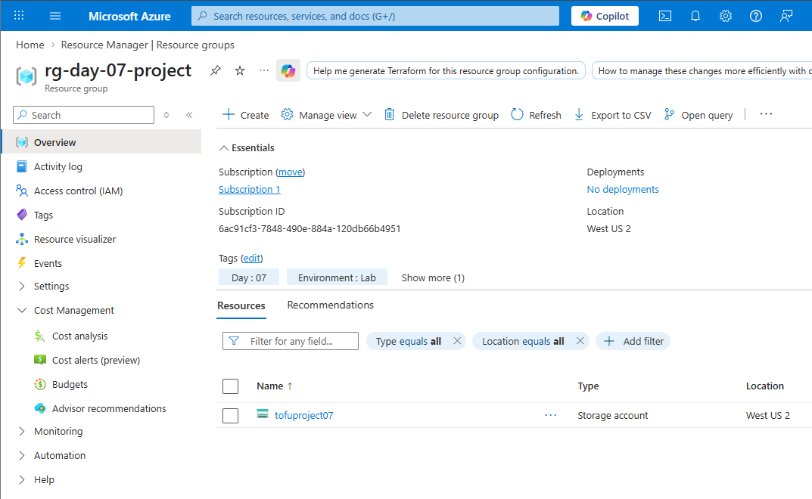
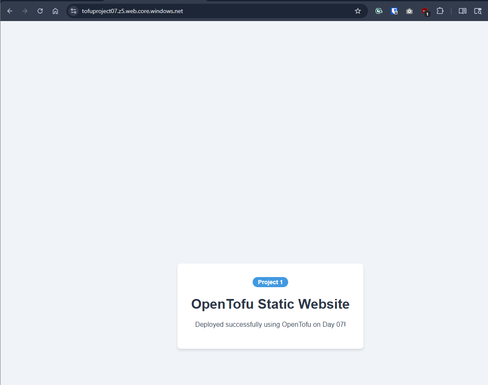

# Day 07

## Project 1: Deploy a Static Website to Azure Blob Storage

**Static Website Hosting** in Azure Storage is a cost-effective way to host web content that doesn't require server-side processing. This project combines everything you've learned so far: resources, variables, outputs, and dependencies.

## Why use Static Websites?

1. **Cost Efficiency:** You only pay for the storage and data egress, no compute costs.
2. **Scalability:** Azure Storage handles high traffic automatically.
3. **Simplicity:** No servers to patch or maintain.

---

## Checklist

- [x] Create an `azurerm_resource_group`.
- [x] Create an `azurerm_storage_account` with `account_tier = "Standard"` and `account_replication_type = "LRS"`.
- [x] Use the `azurerm_storage_account_static_website` resource to enable hosting.
- [x] Use `azurerm_storage_blob` to upload an `index.html` file.
- [x] Surface the website URL in an `output` block.

---

## Lab: Build and Deploy

In this project, you will deploy a functional (albeit simple) website to the cloud.

### Steps

1. Create an `index.html` file with some basic HTML content.
2. Define your infrastructure in `main.tf`.
3. Run `tofu init`.
4. Run `tofu apply`.
5. Copy the `website_url` from the output and open it in your browser!

## Screenshots

### 1. Storage Account Configuration

*This screenshot shows the successfully provisioned Storage Account in the Azure Portal, highlighting the static website feature and the primary endpoint configuration.*

### 2. Live Static Website

*The final result: Your `index.html` file is now served over the public internet via the Azure Storage static website endpoint.*

---
*Back to [Main README](../README.md)*
