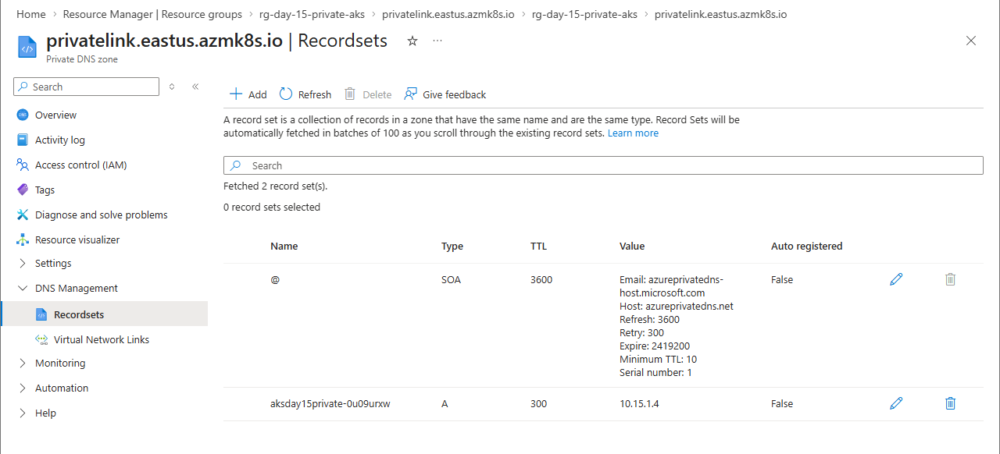
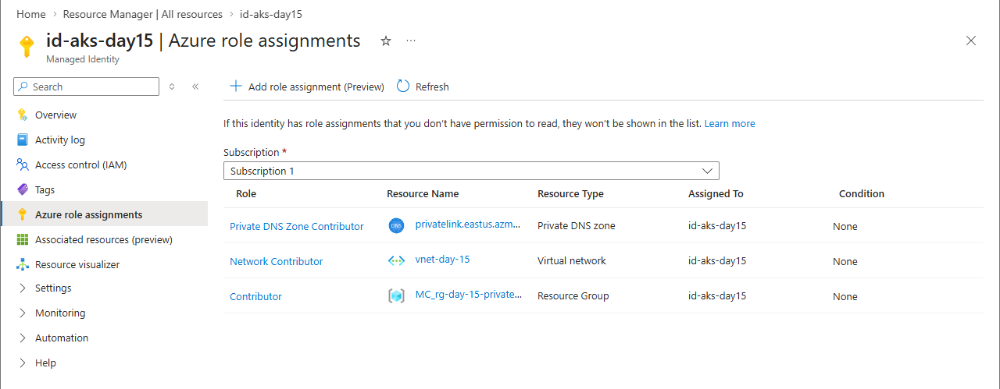

# Day 15: Project 2 - Secure AKS with Private Networking

## Introduction

In Day 13 and 14, we built a functional AKS cluster, but it was "Public" (accessible over the internet). For production enterprise workloads, this is a security risk.

**Private AKS** ensures that the API server (the "brain") is only accessible from within your private Virtual Network (VNet).

## Key Concepts

- **Private Cluster:** The API server has a private IP address. Public access is disabled.
- **Private Link:** The technology that "injects" the API server into your VNet.
- **Private DNS Zone:** Since the API server has a private IP, we need a private DNS record (e.g., `*.privatelink.eastus.azmk8s.io`) to resolve its address.
- **Network Isolation:** No one from the outside world can run `kubectl` commands against your cluster without being "inside" your network (via VPN, Bastion, or a Jumpbox).

---

## Checklist

- [x] Create a `Virtual Network` and a dedicated `Subnet`.
- [x] Set up a `Private DNS Zone` for the AKS API server.
- [x] Provision an `AKS Cluster` with `private_cluster_enabled = true`.
- [x] Observe that the API server FQDN now resolves to a private IP.

---

## Lab: Locking Down the API

In this project, you will move your cluster off the grid.

### Steps

1. Initialize your directory with `tofu init`.
2. Review `main.tf` to see how we link the Private DNS Zone to the VNet.
3. Run `tofu apply`. **Note:** Private clusters can take slightly longer to provision (~10-15 minutes).
4. Try to run `kubectl get nodes` from your local machine.
   - *It will fail.* Why? Because your local machine is not inside the private VNet.
5. In a real scenario, you would now set up an "Azure Bastion" or a "Jumpbox" VM inside the same VNet to manage the cluster.

## Screenshots

### 1. Private Network Configuration

*This screenshot from the Azure Portal confirms that the AKS cluster is provisioned within the private VNet and has public network access disabled.*

### 2. User Assigned Identity Roles

*The role assignments for the Managed Identity, showing the "Private DNS Zone Contributor" and "Network Contributor" permissions required for the private cluster.*

---
*Back to [Main README](../README.md)*
