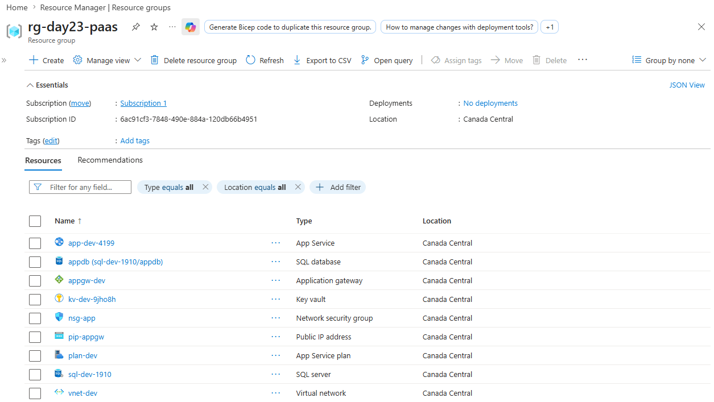
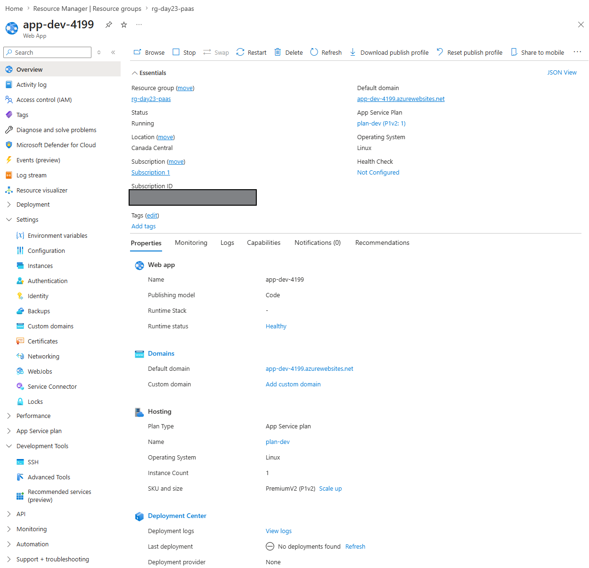
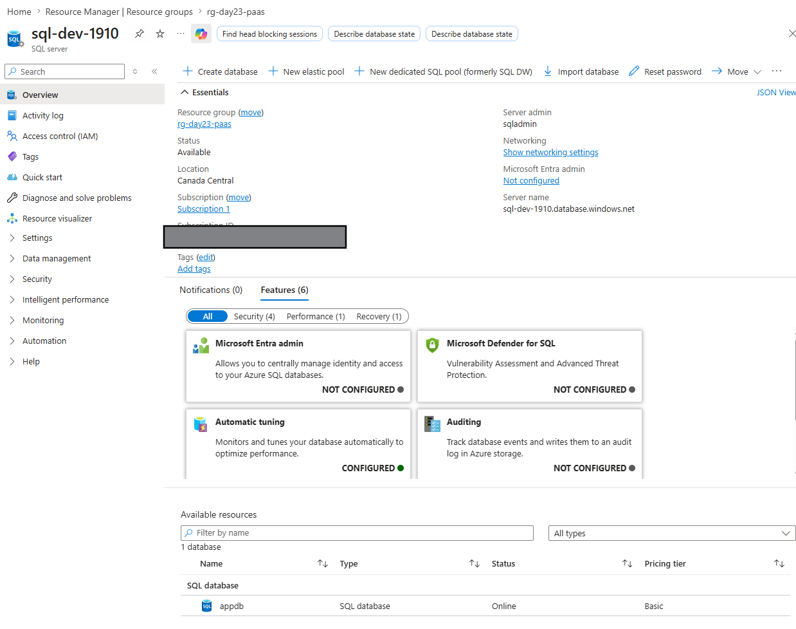
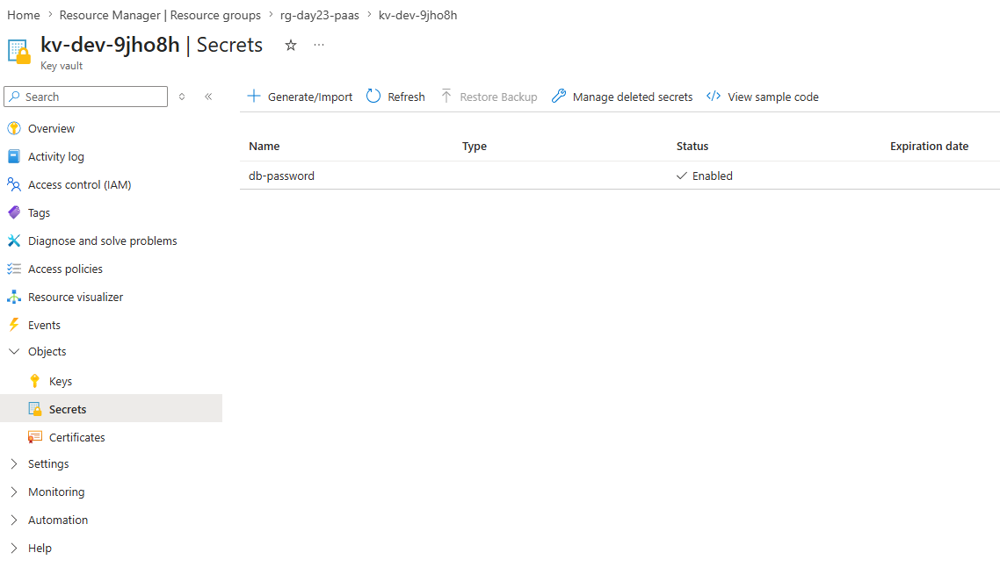
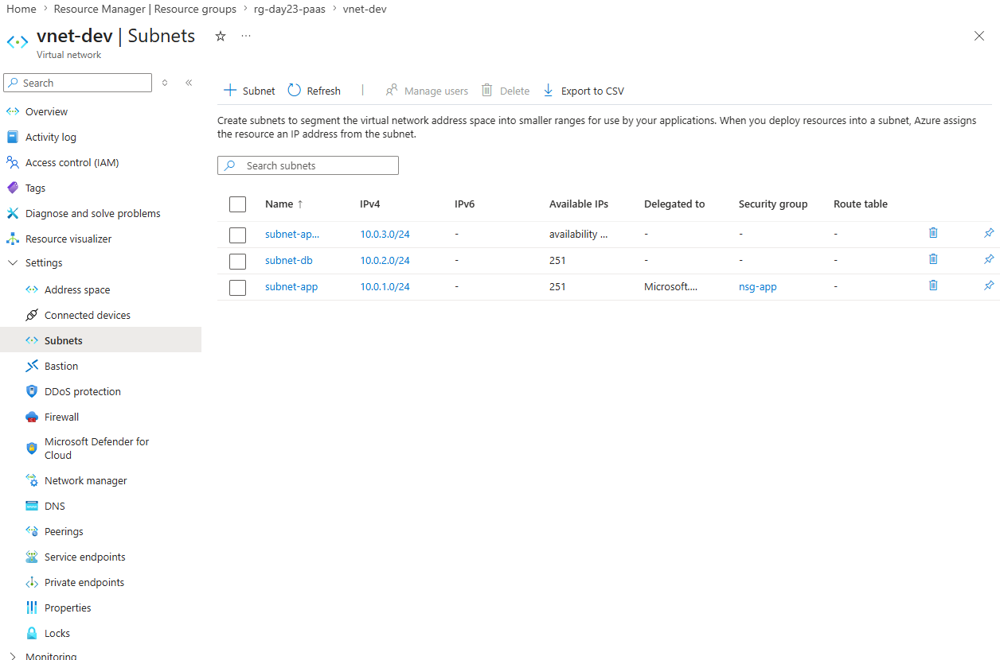

# Day 23: Secure Multi-tier PaaS Architecture

## Introduction

Day 23 is a capstone project combining App Service, SQL Database, Key Vault, and Application Gateway into a hardened, production-ready architecture. All components are secured with VNet integration, network policies, and secrets management.

This day is about: **How do we architect a complete, secure, enterprise PaaS application?**

## Key Concepts

- **VNet Integration:** App Service connects to private subnets, isolated from public internet.
- **Network Security:** NSGs and firewall rules restrict traffic flow.
- **Secrets Management:** Connection strings and credentials stored in Key Vault.
- **Database Security:** SQL database behind VNet rules, accessible only from approved sources.
- **WAF Protection:** Application Gateway with Web Application Firewall rules.
- **Managed Identity:** App Service uses SystemAssigned identity for secure Key Vault access.

---

## Checklist

- [x] Create secure VNet with dedicated subnets for App Service, SQL, and App Gateway.
- [x] Deploy App Service with VNet integration and managed identity.
- [x] Deploy SQL Database with VNet rules and firewall policies.
- [x] Store database credentials in Key Vault.
- [x] Deploy Application Gateway with WAF in Detection mode.
- [x] Configure NSGs to restrict inbound traffic (HTTPS/HTTP only).
- [x] Grant App Service identity access to Key Vault secrets.

---

## Lab: Deploy Multi-tier PaaS Stack

In this lab, you deploy a complete, hardened application stack.

### Steps

1. Initialize with `tofu init`.
2. Review `main.tf`:
   - VNet architecture: app subnet + DB subnet + App Gateway subnet.
   - App Service with VNet integration and SystemAssigned identity.
   - SQL Server and Database with VNet rules and firewall.
   - Application Gateway with WAF.
   - Key Vault for secrets, with App Service identity access policy.
3. Run `tofu apply`.
4. Verify the deployment:

   ```bash
   tofu output
   az webapp show --resource-group rg-day23-paas --name app-dev-<random>
   az sql server list --resource-group rg-day23-paas
   az keyvault show --resource-group rg-day23-paas --name kv-dev-<suffix>
   ```

5. Test App Service connectivity to SQL:
   - SSH into the App Service and query the database via connection string stored in Key Vault.
6. Review Application Gateway:
   - Go to Azure Portal → Application Gateways → `appgw-dev`.
   - Verify WAF is running in Detection mode.

## Screenshots

### 1. Resource Group Deployment

*All resources deployed successfully in resource group rg-day23-paas.*


### 2. App Service Running

*Azure Portal showing the App Service with VNet integration and managed identity enabled.*


### 3. SQL Database with VNet Rules

*SQL Server firewall and VNet rules configured, allowing traffic only from the integrated App Service subnet.*


### 4. Key Vault Secrets

*Key Vault displaying database credentials with App Service managed identity granted access.*


### 5. Virtual Network Topology

*Complete VNet with three subnets: App Service, SQL Database, and Application Gateway subnets.*


---

*Back to [Main README](../README.md)*
