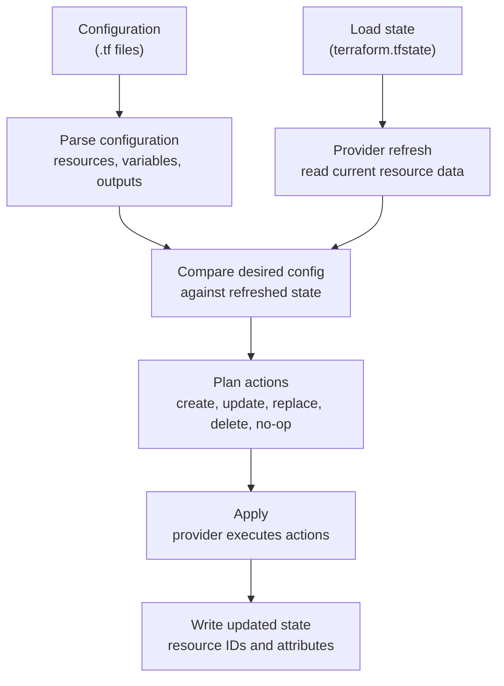

# Day B1: State and Providers

## Introduction

Appendix B1 establishes the mental model for how OpenTofu knows what infrastructure exists, what it manages, and what needs to change.

Running `tofu init`, `tofu plan`, and `tofu apply` is straightforward. The important question is: **how does OpenTofu know the difference between the infrastructure you want now and the infrastructure it managed before?**

The answer comes from three inputs:

- Your configuration files describe the desired infrastructure.
- The state file records what OpenTofu believes it manages.
- Providers read and change real infrastructure through platform APIs.

## Key Concepts

- **Configuration:** The `.tf` files declare the desired end state.
- **State:** The state file maps resource addresses like `null_resource.state_probe` to real resource IDs and stored attributes.
- **Provider:** A plugin that knows how to create, read, update, and delete a specific kind of infrastructure.
- **Refresh:** The provider reads the current real-world object and updates OpenTofu's working view before planning changes.
- **Plan:** OpenTofu compares desired configuration against refreshed state and decides whether to create, update, replace, delete, or do nothing.
- **Apply:** OpenTofu asks providers to make the planned changes, then writes the new result back into state.

### Mapping the Moving Parts

| OpenTofu Part | Function | Example |
| :--- | :--- | :--- |
| Configuration | Defines what you want. | `resource "null_resource" "state_probe"` |
| State | Records what OpenTofu manages. | `terraform.tfstate` |
| Provider | Talks to the target API or system. | `hashicorp/null` |
| Resource address | Stable name inside OpenTofu. | `null_resource.state_probe` |
| Resource ID | Provider-specific real object ID. | Generated ID from the `null` provider. |
| Plan | Shows the difference before changes happen. | `+ create`, `~ update`, `-/+ replace` |

### How OpenTofu Processes a Run

When you run OpenTofu, it does not blindly execute the `.tf` files from top to bottom. It builds a working model from configuration, state, and provider data, then decides what actions are required.

| Command | Internal Process |
| :--- | :--- |
| `tofu init` | Reads the `required_providers` block, downloads the provider binary into `.terraform/`, and records the selected provider version in `.terraform.lock.hcl`. |
| `tofu plan` | Parses `.tf` files, loads `terraform.tfstate` if it exists, calls the provider to read current resource data, then compares config values against state/provider values. |
| `tofu apply` | Executes the planned provider operations, receives the resulting resource IDs and attributes from the provider, then writes those values into `terraform.tfstate`. |

The normal flow looks like this:



The key idea is that state is the memory, providers are the API translators, and the plan is the comparison between what you declared and what OpenTofu currently knows.

---

## Checklist

- [x] Understand the difference between configuration, state, and real infrastructure.
- [x] Initialize a provider with `tofu init`.
- [x] Create a local test resource with `tofu apply`.
- [x] Inspect the state with `tofu state list` and `tofu state show`.
- [x] Change configuration and explain why the next plan changes.

---

## Lab: Inspecting State and Provider Behavior

In this lab, you use the `null` provider to create a safe local resource and inspect how OpenTofu records it in state.

### Steps

1. Initialize the working directory:

   ```bash
   tofu init
   ```

2. Review the proposed action:

   ```bash
   tofu plan
   ```

3. Apply the configuration:

   ```bash
   tofu apply -auto-approve
   ```

4. Inspect what OpenTofu now tracks:

   ```bash
   tofu state list
   tofu state show null_resource.state_probe
   ```

5. Inspect the raw state file:

   ```bash
   less terraform.tfstate
   ```

6. Change the `lab_name` value in `variables.tf`, then run another plan:

   ```bash
   tofu plan
   ```

---
*Back to [Main README](../README.md)*
