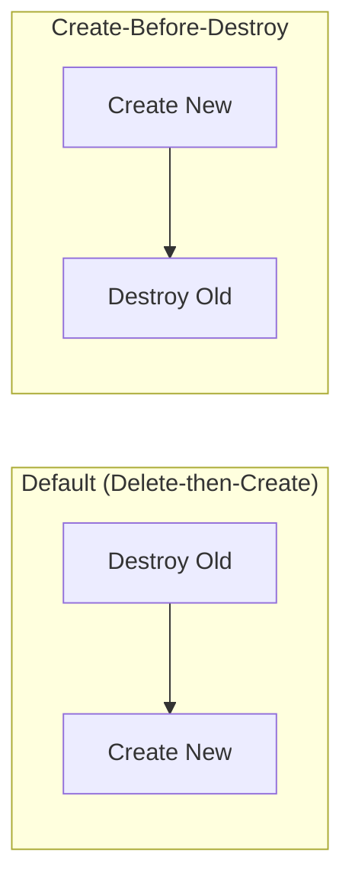
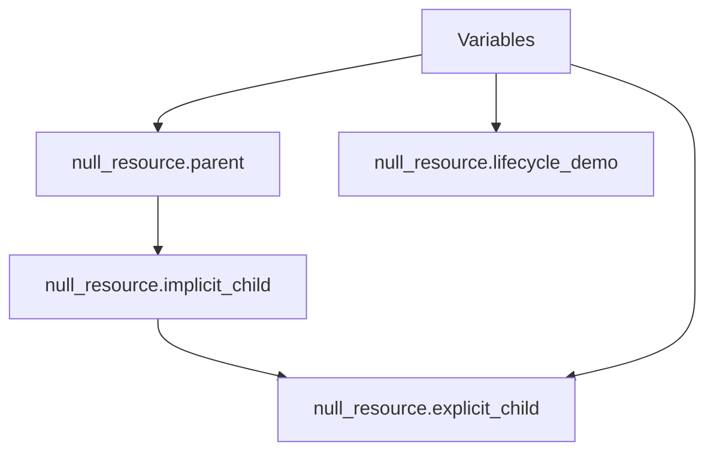

# Day B2: Dependency Graphs and Lifecycle

## Introduction

Appendix B2 explores the logic OpenTofu uses to decide **the order** in which resources are created, updated, or destroyed.

Infrastructure is rarely a flat list of items. A virtual machine needs a network; a network needs a resource group. OpenTofu does not rely on the order of resources in your `.tf` files. Instead, it builds a **Directed Acyclic Graph (DAG)** to map these relationships.

## Key Concepts

- **Dependency Graph:** A mathematical map where nodes are resources and edges are dependencies.
- **Implicit Dependency:** Created automatically when one resource references an attribute of another (e.g., `subnet_id = aws_subnet.main.id`).
- **Explicit Dependency:** Manually defined using the `depends_on` meta-argument. Used when a dependency exists that OpenTofu cannot see (e.g., an application needs an IAM role to be active).
- **Parallelism:** OpenTofu walks independent branches of the graph simultaneously (defaulting to 10 concurrent operations).
- **Lifecycle Meta-arguments:** Overrides for default behavior, such as `create_before_destroy` or `prevent_destroy`.

### The Graph Walk

When you run a plan, OpenTofu "walks" the graph. It starts at the resources with no dependencies (the roots) and works its way down to the leaf nodes.

| Dependency Type | How it's defined | OpenTofu Behavior |
| :--- | :--- | :--- |
| **Implicit** | Attribute reference | Wait for the provider to return the ID/Attribute before starting the next resource. |
| **Explicit** | `depends_on = [...]` | Complete the "Apply" of the target resource entirely before starting this one. |
| **Independent** | No connection | Process both resources in parallel. |

### Resource Lifecycle Decisions

Normally, if a resource must be replaced, OpenTofu follows a **Delete-then-Create** pattern. You can invert this for zero-downtime scenarios.



---

## How OpenTofu Processes the Graph

The internal engine goes through these stages to ensure ordering:

1. **Graph Construction:** Scans all `.tf` files to identify resources and their links.
2. **Cycle Detection:** Ensures there are no circular dependencies (e.g., A needs B, and B needs A).
3. **Graph Pruning:** Removes resources from the walk that aren't being changed.
4. **Walking the Graph:** Executes provider actions in the mathematically correct order.



---

## Checklist

- [x] Explain the difference between implicit and explicit dependencies.
- [x] Use `tofu graph` to generate a visual representation of the plan.
- [x] Understand how `create_before_destroy` changes the execution sequence.
- [x] Identify a circular dependency error and know how to fix it.

---

## Lab: Inspecting Graph and Ordering

In this lab, you will visualize the dependency graph and observe how OpenTofu serializes operations.

### Steps

1. **Initialize and Plan:**
   ```bash
   tofu init
   tofu plan
   ```

2. **Generate and Visualize the Graph:**
   To see the dependency graph, you can use the raw command or pipe it to an image generator:

   **Option A: Generate raw DOT text (for Online Visualizers)**
   ```bash
   tofu graph
   ```
   *Copy the output and paste it into [Edotor.net](https://edotor.net/) or [Graphviz Online](https://dreampuf.github.io/GraphvizOnline/).*

   **Option B: Generate a PNG image (requires Graphviz installed)**
   ```bash
   tofu graph | dot -Tpng > graph.png
   ```

3. **Apply and Observe Order:**
   Notice that `parent` is created before `implicit_child`.
   ```bash
   tofu apply -auto-approve
   ```

4. **Test Explicit Dependency:**
   Review `main.tf`. Note that `explicit_child` has no attribute reference to `implicit_child`, but it is still forced to wait because of `depends_on`.

5. **Observe Lifecycle Override:**
   Change the `prefix` in `variables.tf` and run a plan. Notice how `lifecycle_demo` would be handled if a replacement were triggered (though `null_resource` usually updates in place, the lifecycle configuration is validated during the walk).

---
*Back to [Main README](../README.md)*
