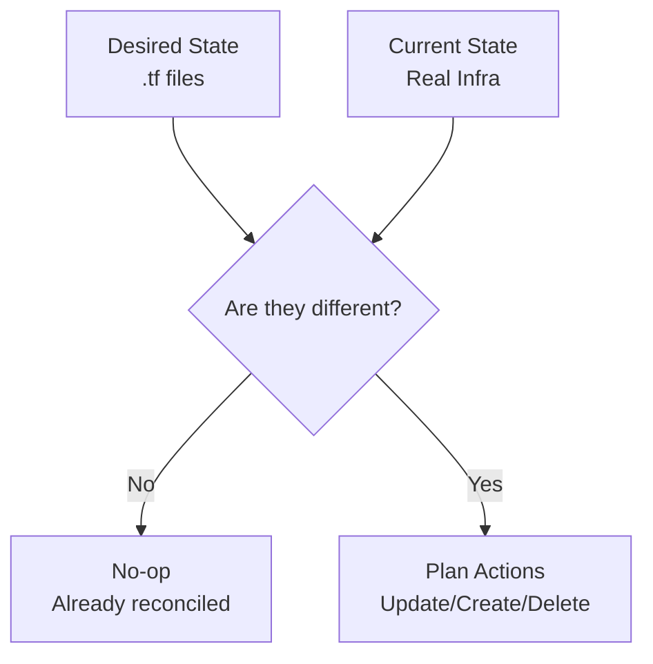

# Day B3: Declarative Reconciliation and Idempotency

## Introduction

Appendix B3 explains the core philosophy of Infrastructure as Code: **Declarative Reconciliation**.

In imperative scripts (like Bash or Python), you tell the computer *how* to do something (e.g., "Create this folder, then download this file"). In OpenTofu, you tell it *what* you want the world to look like. OpenTofu is responsible for figuring out how to get there.

## Key Concepts

- **Declarative:** You define the goal state, not the steps.
- **Current State:** What exists right now (discovered via state file + provider refresh).
- **Desired State:** What is defined in your `.tf` files.
- **Reconciliation:** The process of moving the current state to the desired state.
- **Idempotency:** A property where an operation can be applied multiple times without changing the result beyond the initial application.

### The Reconciliation Loop

Every time you run `tofu plan` or `tofu apply`, OpenTofu runs a reconciliation loop:

1. **Refresh:** Observe the "Current State" of real resources.
2. **Diff:** Compare "Current State" against the "Desired State" (the config).
3. **Act:** If they differ, create a plan to close the gap. If they are the same, do nothing (**Idempotency**).



---

## Why Idempotency Matters

In traditional automation, running a "Create" script twice might cause an error because the resource already exists. In OpenTofu:
- The first run creates the resource.
- The second run sees the resource already exists and matches the config, so it does **nothing**.

This allows you to run your deployment pipelines safely on every commit, knowing that only necessary changes will be applied.

---

## Checklist

- [x] Define "Declarative" vs "Imperative".
- [x] Explain why a second `tofu apply` results in "No changes" (Idempotency).
- [x] Understand how OpenTofu handles a "drift" where the real world no longer matches the config.

---

## Lab: Observing Idempotency

In this lab, you will see how OpenTofu handles multiple runs and what happens when you introduce a change.

### Steps

1. **First Apply:**
   Create the initial resources.
   ```bash
   tofu init
   tofu apply -auto-approve
   ```

2. **The "No-op" Test (Idempotency):**
   Run apply again immediately without changing anything.
   ```bash
   tofu apply -auto-approve
   ```
   *Observe: OpenTofu reports "No changes. Your infrastructure matches the configuration."*

3. **Introduce a Change:**
   Modify the `content` variable:
   ```bash
   tofu apply -var="content=Something New" -auto-approve
   ```
   *Observe: OpenTofu detects the difference and reconciles the state by updating the resource.*

4. **Review the Logic:**
   Why didn't `null_resource.idempotency_check` change in step 3? Because its "Current State" still matched its "Desired State."

---
*Back to [Main README](../README.md)*
