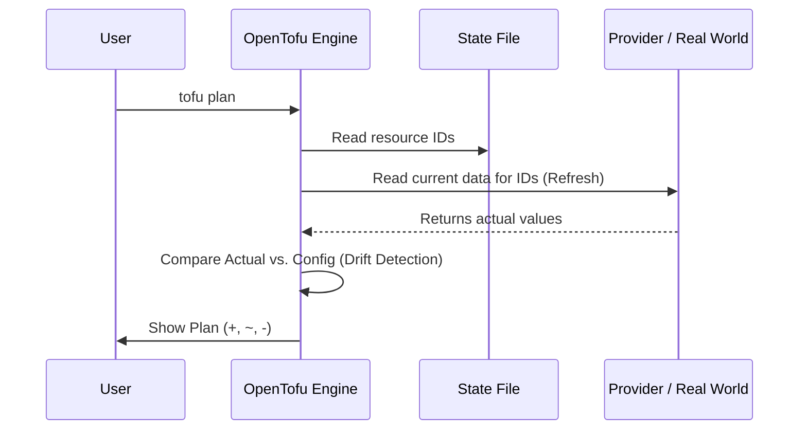

# Day B4: Drift Detection and Refresh

## Introduction

Appendix B4 covers the "Day 2" reality of Infrastructure as Code: **Drift**.

In a perfect world, the only way infrastructure changes is through your `.tf` files. In the real world, someone might click a button in the Cloud Console, a script might run, or a resource might fail. When the real-world infrastructure no longer matches your configuration, we call this **Configuration Drift**.

## Key Concepts

- **Refresh:** The process where OpenTofu calls the Provider API to read the current state of real-world resources.
- **Drift:** The delta between what is in your Configuration and what actually exists in the Real World.
- **In-place Update (`~`):** OpenTofu detects a change and plans to overwrite it to match your config.
- **Destructive Re-creation (`-/+`):** The drift is so significant (or the attribute is immutable) that OpenTofu must delete and recreate the resource.

### The Refresh Flow

When you run `tofu plan`, the first thing that happens is a hidden `tofu refresh`.



---

## Handling Drift

When drift is detected, you have two architectural choices:

1. **Enforce Configuration:** Run `tofu apply` to overwrite the manual changes and bring the infrastructure back to the "Authorized" state.
2. **Accept Changes:** Update your `.tf` code to match the new real-world reality, then run `tofu apply` to update the state file without changing the infrastructure.

---

## Checklist

- [x] Define "Configuration Drift."
- [x] Explain the role of `tofu refresh` (and why it runs during plan).
- [x] Perform a manual "drift" and observe OpenTofu detect it.
- [x] Reconcile drift by enforcing the configuration.

---

## Lab: Simulating and Fixing Drift

In this lab, you will create a file, manually edit it "behind OpenTofu's back," and see how the engine responds.

### Steps

1. **Initial Deployment:**
   ```bash
   tofu init
   tofu apply -auto-approve
   ```
   *Check the folder; you should see a file named `drift_test.txt`.*

2. **Verify Steady State (Idempotency):**
   ```bash
   tofu plan
   ```
   *Observe: "No changes. Your infrastructure matches the configuration."*

3. **Manually "Drift" the Infrastructure:**
   Open `drift_test.txt` in your editor and change the text, or use the command line:
   ```bash
   echo "This is a manual change made outside of OpenTofu!" > drift_test.txt
   ```

4. **Detect the Drift:**
   ```bash
   tofu plan
   ```
   *Observe: OpenTofu detects the change! It will show a `~ update in-place` because the content no longer matches your `desired_content` variable.*

5. **Fix the Drift:**
   ```bash
   tofu apply -auto-approve
   ```
   *Open `drift_test.txt` again. Notice that OpenTofu has overwritten your manual change with the authorized content from HCL.*

---
*Back to [Main README](../README.md)*
